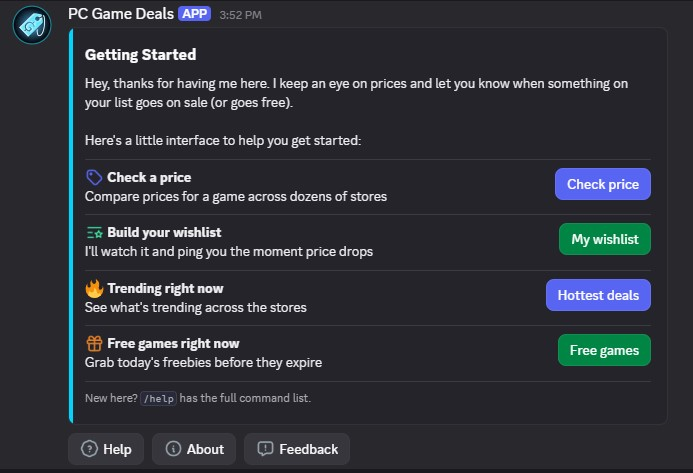
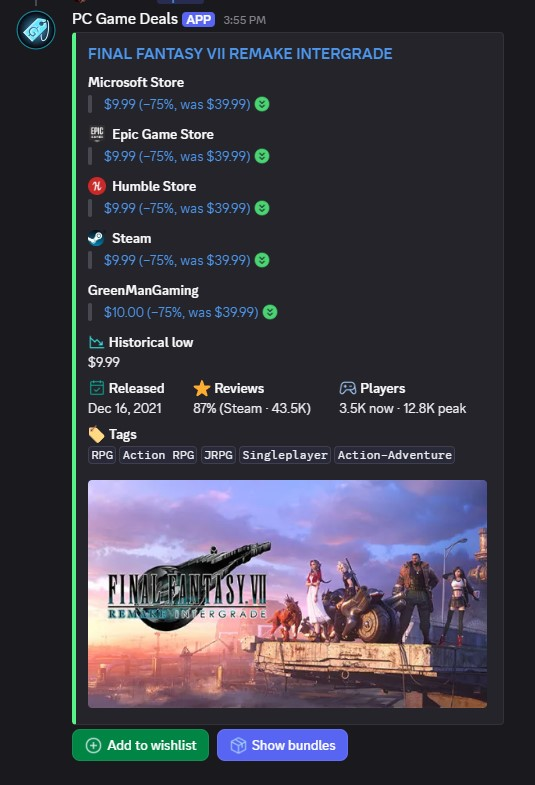
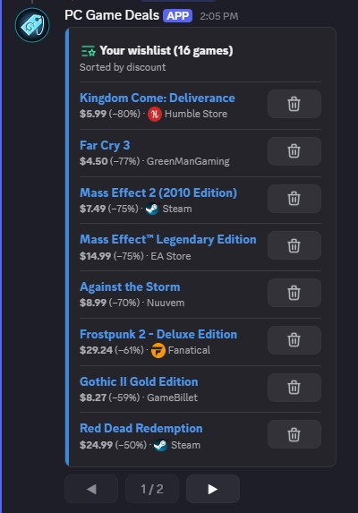
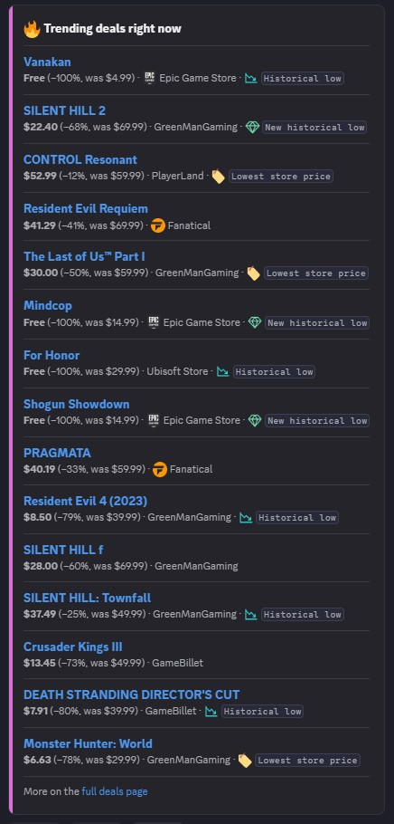
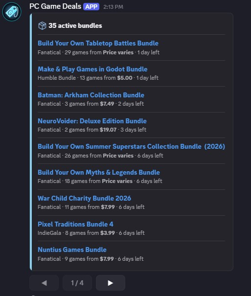
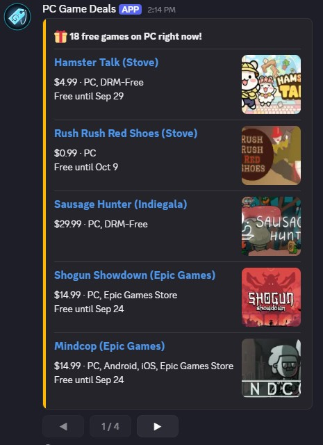

# PC Game Deals

A Discord bot that tracks PC game prices across dozens of stores, watches your wishlist for price drops, and surfaces free games and bundles.

[](https://github.com/Akiz-Ivanov/discord-game-sales-bot/actions/workflows/ci.yml)
[](./LICENSE)



---

> **Status:** currently running in a single test server while final polish lands. Global command registration (so the bot can be invited to any server) is planned soon — invite instructions will be added here once that ships.

## Table of contents

- [What it does](#what-it-does)
- [Commands](#commands)
- [Screenshots](#screenshots)
- [Architecture](#architecture)
- [Tech stack](#tech-stack)
- [Testing](#testing)
- [Running it locally](#running-it-locally)
- [Deployment](#deployment)
- [Privacy](#privacy)
- [Credits](#credits)
- [License](#license)

## What it does

**PC Game Deals** is a Discord bot for tracking PC game prices. Look up any game's current price across stores, build a wishlist, and get notified when something on it goes on sale.

- 🏷️ **`/price`** — look up any game's current prices across stores, with historical low, review score, and player counts
- ⭐ **Wishlist** — track games you're interested in, with a daily check that pings you when a game from your wishlist goes on sale
- 🔥 **`/trending`** — see what's trending in deals right now
- 📦 **`/bundles`** — browse active bundle deals, or check bundles for one specific game
- 🎁 **`/free`** — currently free PC games, refreshed weekly
- 🔒 Privacy-first from the start — `/forget-me`, a full `/privacy` page, and a "what the bot stores" summary in-Discord

## Commands

| Command | What it does |
|---|---|
| `/price <game>` | Look up current prices for a game across stores (autocomplete on title) |
| `/wishlist add` / `remove` / `list` | Manage your personal wishlist |
| `/trending` | See what's trending in deals right now |
| `/bundles` | Browse currently active bundle deals |
| `/free` | Show currently free PC games |
| `/about` | What the bot does and where its data comes from |
| `/help` | List all commands |
| `/feedback` | Report a bug or suggest something (optional screenshot) |
| `/forget-me` | Permanently delete your wishlist and stored data |
| `/privacy-policy` | Show what data is stored and how to remove it |
| `/config alerts-channel` *(admin only)* | Set the channel for sale/free-game alerts |
| `/config remove-alerts` *(admin only)* | Remove this server's alert configuration |
| **Quick access** *(right-click the bot → Apps)* | Opens the same interface as the welcome card |

## Screenshots

<table>
<tr>
<td width="50%">

**`/price`** — cheapest-first deals, historical low, review score, tags



</td>
<td width="50%">

**`/wishlist list`** — sorted by discount, free games first



</td>
</tr>
<tr>
<td width="50%">

**`/trending`** — matches IsThereAnyDeal's own "hottest deals" sort



</td>
<td width="50%">

**`/bundles`** — browse every currently active bundle



</td>
</tr>
</table>

**`/free`** — currently free PC games, refreshed weekly



## Architecture

Layered structure, no gateway connection — the bot runs entirely on Discord's HTTP Interactions model, which means it needs no always-on host.

```
discord/    → transport layer: parses interactions, builds replies
              (commands / components / modals / autocomplete / embeds / views)
services/   → business logic, orchestrates repositories + external APIs
repositories/ → all Postgres access (Drizzle)
itad/ · gamerpower/ → typed clients for the two external APIs
lib/        → pure, cross-cutting helpers (formatting, pagination, etc.)
```

A few decisions worth calling out:

- **Same-day price caching.** Every price check writes to Postgres, keyed by `(game, shop, day)` with a real unique index — a `/price` lookup within the same UTC day reads the cache instead of re-hitting the API, and a daily cron still logs full price history from day one, before anything even displays it.
- **Discord's newer Components V2** for every paginated view (`/wishlist list`, `/bundles`, `/trending`, sale alerts) — with real component-budget math behind each one, since Discord caps a message at 40 total components. `/price` deliberately stays on classic embeds instead, after V2 hit hard layout limits (no proportional image scaling, no two-column price/metadata layout) that classic embeds don't have.
- **Deferred responses where they're needed, not everywhere.** A few commands (`/free`, the wishlist remove button, `/feedback`'s screenshot upload) defer their reply and do the real work in the background, specifically because they depend on a slow external call that risks blowing Discord's 3-second ACK window. Everything else replies synchronously.
- **A real end-to-end test suite** — signed interaction payloads through the actual, unmocked route → command handler → service → repository → a real Postgres instance, with external APIs (ITAD, Discord, GamerPower) mocked at the network boundary via MSW, not deeper in the stack.

<!-- Optional: for the full build log — every feature, bug, and design decision as it happened —
see [TODO.md](./TODO.md). -->

## Tech stack

Next.js (App Router) · TypeScript · Discord HTTP Interactions · Drizzle ORM · Neon Postgres · Vercel Cron · Vitest · MSW · GitHub Actions

## Testing

500+ tests, ~98.5% coverage, run in CI on every push/PR to `main`.

```bash
npm test              # full suite: unit, repository, and e2e tests
npm run test:watch    # watch mode
```

Repository and end-to-end tests run against a real local Postgres (via Docker + a Neon HTTP proxy) — see [Running it locally](#running-it-locally) to set that up.

## Running it locally

**Requirements:** Node 24+, Docker

```bash
git clone https://github.com/Akiz-Ivanov/discord-game-sales-bot.git
cd discord-game-sales-bot
npm install
```

**1. Start local Postgres** (used by tests, and optionally by local dev):

```bash
docker compose up -d
```

**2. Environment variables** — create `.env.local` with:

| Variable | Used for |
|---|---|
| `DISCORD_PUBLIC_KEY` | Verifying incoming Discord interaction signatures |
| `DISCORD_BOT_TOKEN` | Bot-authenticated REST calls (posting alerts, registering commands) |
| `DISCORD_APPLICATION_ID` | Editing/following up on interaction responses |
| `DISCORD_TEST_GUILD_ID` | Guild-scoped command registration (see below) |
| `ITAD_API_KEY` | IsThereAnyDeal API access |
| `DATABASE_URL` | Your Postgres connection string |
| `CRON_SECRET` | Authenticates Vercel Cron's calls to the cron routes |
| `FEEDBACK_CHANNEL_ID` | Private channel `/feedback` submissions post to |

For running the test suite specifically, copy `.env.test.example` to `.env.test` — it only needs `DATABASE_URL` pointed at the Docker Postgres above.

**3. Apply the database schema** — migrations live in `drizzle/` as versioned SQL files; apply them to whichever Postgres `DATABASE_URL` points at (e.g. via `psql`, or your Neon project's SQL editor).

**4. Register commands** (guild-scoped, for local testing):

```bash
npm run register-commands
```

**5. Run it:**

```bash
npm run dev
```

Discord needs a public HTTPS URL to send interactions to — during local development, tunnel your dev server with [ngrok](https://ngrok.com) (or similar) and point the Interactions Endpoint URL in the Discord Developer Portal at `https://<your-tunnel>/api/interactions`.

## Deployment

Deployed on Vercel. Daily/weekly checks (wishlist price alerts, free-game giveaways) run via Vercel Cron, configured in `vercel.json`.

## Privacy

This bot is built privacy-first: `/forget-me` deletes all personal data on request, `/config remove-alerts` lets server admins remove server-level config, and `/privacy-policy` gives an in-Discord summary linking to the full policy at [discord-game-sales-bot.vercel.app/privacy](https://discord-game-sales-bot.vercel.app/privacy).

## Credits

- Price data from [IsThereAnyDeal](https://isthereanydeal.com)
- Free-game listings from [GamerPower](https://www.gamerpower.com)
- Discord profile banner designed by [upklyak – Magnific.com](https://www.magnific.com)
- App icon: ["Price tag" by Delapouite](https://game-icons.net/1x1/delapouite/price-tag.html), licensed under [CC BY 3.0](https://creativecommons.org/licenses/by/3.0/)

## License

[MIT](./LICENSE)